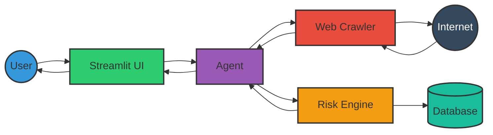
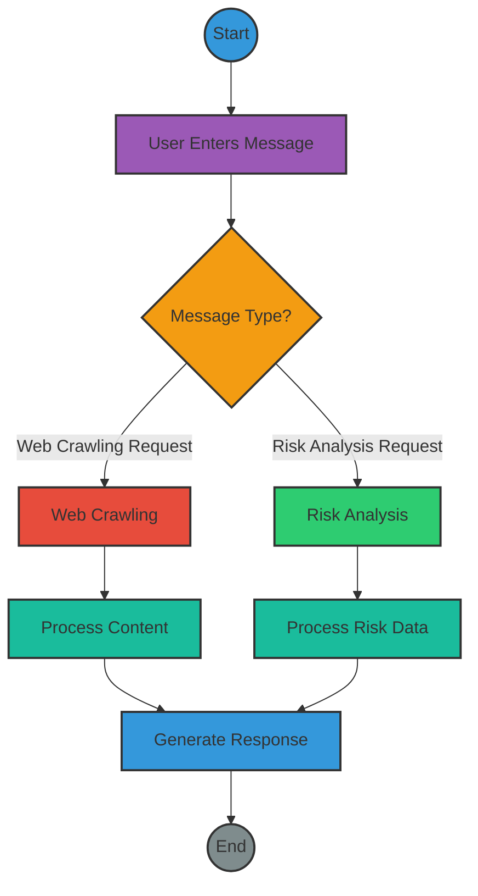

# Web Crawler Conversational Agent

A web crawler conversational agent powered by Google's Gemini model that can search and extract information from the internet to answer user queries and analyze company risk profiles.

## Recent Updates

- **Enhanced Risk Engine**: Improved business risk analysis capabilities with detailed sector risk multipliers and better financial metric extraction
- **Dual Crawler System**: Simple Crawler using requests/BeautifulSoup as the primary crawler with Playwright as fallback
- **Improved Reliability**: Enhanced retry logic with progressive timeouts (15s, 22.5s, 30s)
- **Resource Management**: Reduced concurrency (3 workers max) to prevent resource exhaustion
- **Enhanced Error Handling**: Graceful fallbacks between crawlers with comprehensive logging
- **E2E Testing**: Comprehensive end-to-end test suite for validating conversation flows and crawler reliability
- **Improved UI**: Added display of crawled URLs in the interface for transparency
- **Advanced Content Extraction**: More intelligent extraction of content from various website types

## Features

- Natural language conversation with an AI assistant
- Reliable multi-strategy web crawling to fetch relevant information
- Support for crawling multiple websites for comprehensive answers
- **Company risk analysis** using financial data extracted from websites
- Content summarization for large webpages
- Provides sources for all information retrieved with visible URLs
- Beautiful Streamlit user interface
- Comprehensive logging system

## System Architecture

The Web Crawler Agent with Risk Engine integration combines web crawling capabilities with financial risk assessment. The system allows users to interact with a conversational agent that can extract financial information from company websites and analyze the company's risk profile.

### High-level System Architecture



### Process Flow Diagram



### Risk Analysis Process Flow

```mermaid
flowchart LR
    A[Company Website] --> B[Web Crawler]
    B --> C[Content Extraction]
    C --> D[Financial Data<br>Extraction]
    D --> E[Risk Engine]
    E --> F[Risk Factors<br>Evaluation]
    F --> G[Final Score<br>Calculation]
    G --> H[Risk Assessment]
    H --> I[Response to User]

    subgraph Metrics
        M1[Debt-to-Equity Ratio]
        M2[Net Profit]
        M3[Negative News]
        M4[Late Payments]
        M5[Sector Risk]
    end

    D --> Metrics
    Metrics --> F

    style A fill:#3498db,stroke:#333,stroke-width:2px
    style B fill:#e74c3c,stroke:#333,stroke-width:2px
    style C fill:#9b59b6,stroke:#333,stroke-width:2px
    style D fill:#f39c12,stroke:#333,stroke-width:2px
    style E fill:#2ecc71,stroke:#333,stroke-width:2px
    style F fill:#1abc9c,stroke:#333,stroke-width:2px
    style G fill:#3498db,stroke:#333,stroke-width:2px
    style H fill:#9b59b6,stroke:#333,stroke-width:2px
    style I fill:#34495e,stroke:#333,stroke-width:2px,color:#fff
    style Metrics fill:#ecf0f1,stroke:#333,stroke-width:2px
```



### Key Components

- **Streamlit UI**: The user interface built with Streamlit that allows users to interact with the agent
- **Agent**: The core component that processes user messages and orchestrates web crawling and risk analysis
- **Web Crawler**: Dual-crawler system with Simple Crawler (requests/BeautifulSoup) as primary and Playwright as fallback
- **Risk Engine**: FastAPI-based service that evaluates company risk based on financial metrics

## Prerequisites

- Python 3.9 or higher
- Google API Key (Gemini model access)
- Required packages: requests, BeautifulSoup4, Playwright, FastAPI (for risk engine)

## Installation

1. Clone the repository:
```bash
git clone https://github.com/yourusername/web-crawler-agent.git
cd web-crawler-agent
```

2. Create a virtual environment and activate it:
```bash
python -m venv venv
source venv/bin/activate  # On Windows: venv\Scripts\activate
```

3. Install the required packages:
```bash
pip install -r requirements.txt
```

4. Install Playwright browsers (used as fallback crawler):
```bash
python install_playwright.py
```

5. Create a `.env` file with your Google API key:
```
GOOGLE_API_KEY=your_google_api_key_here
```

You can get a Google API key from [Google AI Studio](https://makersuite.google.com/app/apikey).

## Usage

Run the Streamlit app:
```bash
python main.py
```

Then select option 1 to launch the Streamlit UI, or follow the on-screen instructions for other options.

Alternatively, you can run the Streamlit app directly:
```bash
streamlit run ui/streamlit_app.py
```

For risk engine analysis, first start the risk engine server:
```bash
cd risk-engine
python -m app.main
```

## How It Works

1. The user enters a query through the Streamlit UI
2. The agent analyzes the query to determine if web crawling or risk analysis is needed:
   - Checks for direct URLs
   - Detects multi-site information requests
   - Identifies web search queries
   - Detects company risk analysis requests
3. For web crawling, the system uses a dual-crawler approach:
   - **Primary**: Simple Crawler (requests/BeautifulSoup) for reliability
   - **Fallback**: Playwright-based crawler for complex sites
4. For company analysis:
   - Extracts financial data from company websites
   - Sends data to the Risk Engine for evaluation
   - Presents risk scores, factors, and recommendations
5. Multiple retry attempts with progressive timeouts ensure maximum content retrieval
6. The agent formulates a response based on the crawled content and its knowledge
7. The response is displayed to the user along with links to the source URLs

## Risk Analysis

The system can analyze companies for financial risk using five key factors:

1. **Debt-to-Equity Ratio** (30% weight): Measures financial leverage
2. **Net Profit Assessment** (25% weight): Evaluates company earnings
3. **Negative News Score** (20% weight): Measures negative sentiment
4. **Late Payments Rate** (25% weight): Assesses cash flow management
5. **Sector Risk Multiplier**: Adjusts score based on industry sector

The final risk score is classified into three risk levels:
- **0-40**: Low Risk
- **41-70**: Medium Risk
- **71-100**: High Risk

To perform a risk analysis:
1. Ask about a company's risk profile and provide its website: "Analyze the risk for Company X https://company-website.com"
2. The agent will crawl the site, extract metrics, and provide a detailed risk assessment with recommendations

See the [risk.md](risk.md) document for more details on risk analysis methodology.

## Troubleshooting

### Crawler Reliability Issues

If specific websites consistently fail to be crawled:

1. Check the logs for specific error messages (usually 403 Forbidden errors)
2. Some websites actively block automated access and may require manual viewing
3. Try modifying the USER_AGENT in simple_crawler.py to mimic different browsers
4. Adjust timeout settings if network conditions are poor

### Playwright Installation Issues

If you encounter issues with the fallback Playwright installation, try:

```bash
python -m playwright install --with-deps chromium
```

Or run the included installation script:

```bash
python install_playwright.py
```

## Testing

Run the end-to-end test suite to verify that the agent is working correctly:

```bash
python test_e2e_conversation.py
```

The tests include several scenarios:
- News queries (e.g., Israel news)
- Product reviews (e.g., laptop comparisons)
- Technology topics (e.g., programming language comparisons)

Test results are saved as JSON files with timestamps.

## Project Structure

- `agent.py` - The main agent implementation
- `simple_crawler.py` - Primary web crawler using requests/BeautifulSoup
- `tools/web_crawler.py` - Secondary web crawler using Playwright
- `risk_analyzer.py` - Financial data extraction and risk analysis tool
- `risk-engine/` - Business risk evaluation API service
- `ui/streamlit_app.py` - Streamlit UI with source URL display
- `utils/` - Utility functions for error handling and logging
- `tests/` - Test files including end-to-end conversation tests
- `test_e2e_conversation.py` - End-to-end test runner
- `risk.md` - Detailed documentation of risk analysis methodology

## Contributing

Contributions are welcome! Please check out our [Contributing Guidelines](CONTRIBUTING.md) for details on our code of conduct and the process for submitting pull requests.

## License

This project is licensed under the MIT License - see the LICENSE file for details.

## Acknowledgements

- [Google Gemini](https://deepmind.google/technologies/gemini/) for the language model
- [Requests](https://requests.readthedocs.io/) and [BeautifulSoup](https://www.crummy.com/software/BeautifulSoup/) for primary crawling
- [Playwright](https://playwright.dev/) for fallback web crawling capabilities
- [Streamlit](https://streamlit.io/) for the user interface
- [FastAPI](https://fastapi.tiangolo.com/) for the risk engine API 